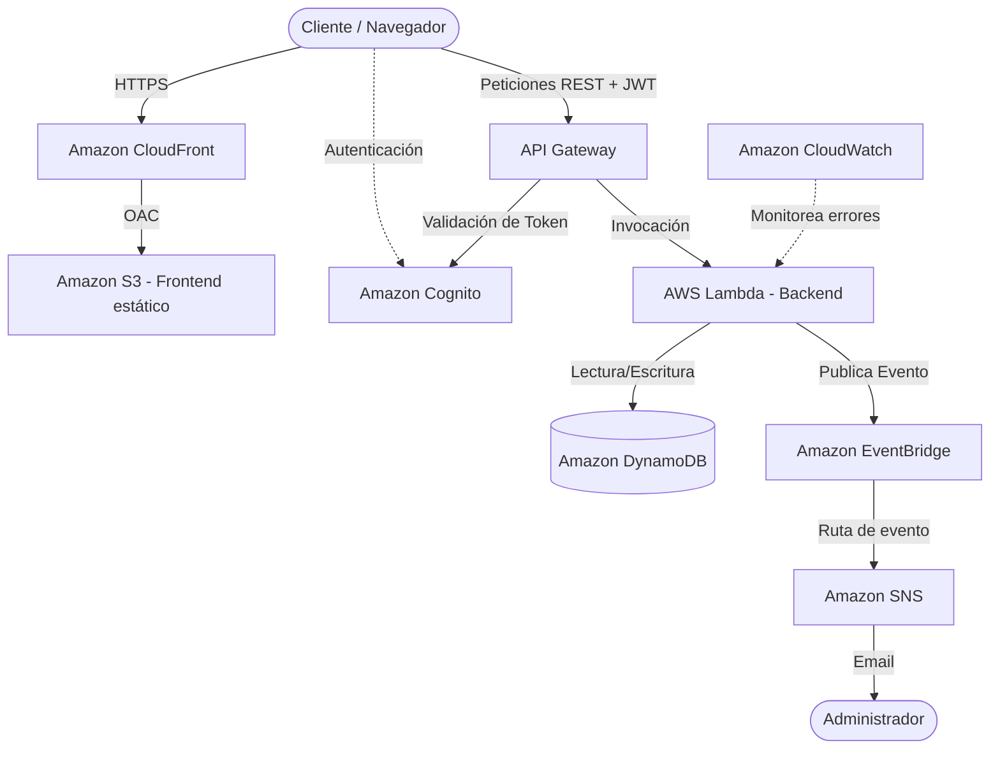

# Arquitectura del Sistema: Plataforma de Talleres

## 1. Diagrama de Arquitectura 

## 2. Decisiones de Arquitectura (ADRs)
* **Serverless First:** Se optó por servicios 100% serverless (Lambda, DynamoDB, API Gateway) para garantizar escalado automático a cero, reduciendo costos operativos y eliminando el mantenimiento de servidores.
* **Desacoplamiento de Eventos:** Se integró Amazon EventBridge para desacoplar el proceso de creación de talleres del sistema de notificaciones (SNS). Esto permite agregar futuros consumidores sin modificar la Lambda principal.
* **Single-Table Design:** DynamoDB se diseñó con un esquema de tabla única, usando `PK` y `SK` para agrupar metadatos y futuras entidades (como inscripciones de usuarios al taller).

## 3. Postura de Seguridad
* **Protección de Origen:** El bucket S3 del frontend es privado. Solo permite tráfico proveniente de la CDN de CloudFront a través de OAC (Origin Access Control).
* **Autenticación (AuthN):** Implementada con AWS Cognito. Los usuarios utilizan su correo como identificador principal.
* **Autorización (AuthZ):** Las rutas mutativas (`POST`) en API Gateway exigen un token JWT válido.
* **Least Privilege (IAM):** Las Lambdas operan con roles estrictos generados por Terraform, con permisos exclusivos a tablas y buses de eventos específicos.

## 4. Link de CloudFront Acceso al Front
URL Publica de CloudFront
https://d76tpp5agfwpl.cloudfront.net/
